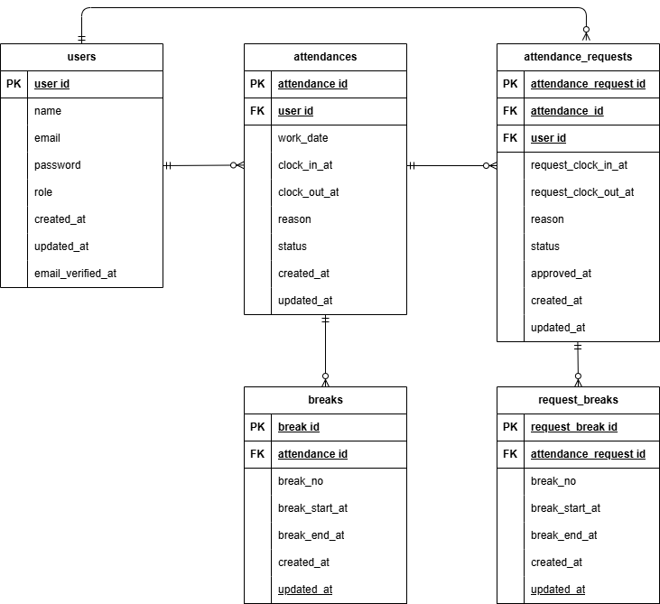

# 勤怠管理アプリ（Attendance Manager）
Laravel × Docker で構築した勤怠管理アプリです。
一般ユーザーと管理者で権限を分離し、修正申請〜承認フローを実装しています。

## 環境構築
1. Dockerを起動

2. プロジェクト直下で実行
```
git clone https://github.com/maiko2323/attendance-manager
cd attendance-manager
docker compose up -d --build
```

3. Laravel初期設定
```
docker compose exec php composer install
docker compose exec php cp .env.example .env
docker compose exec php php artisan key:generate
docker compose exec php php artisan migrate --seed
```

## テストアカウント
### 管理者
email: admin@coachtech.com  
password: password123  
### 一般ユーザ
name: 西 伶奈  
email: reina.n@coachtech.com  
password: password123  
※ 他にも複数名、一般ユーザーをSeederで登録しています。


## テーブル仕様
### usersテーブル
| カラム名 | 型 | primary key | unique key | not null | foreign key |
| --- | --- | --- | --- | --- | --- |
| id | bigint | ◯ |  | ◯ |  |
| name | varchar(255) |  |  | ◯ |  |
| email | varchar(255) |  | ◯ | ◯ |  |
| password | varchar(255) |  |  | ◯ |  |
| role | varchar(20) |  |  | ◯ |  |
| created_at | timestamp |  |  |  |  |
| updated_at | timestamp |  |  |  |  |
| email_verified_at | timestamp |  |  |  |  |

### attendancesテーブル
| カラム名 | 型 | primary key | unique key | not null | foreign key |
| --- | --- | --- | --- | --- | --- |
| id | bigint | ◯ |  | ◯ |  |
| user_id | bigint |  | work_dateとの組み合わせ | ◯ | users(id) |
| work_date | date |  | user_idとの組み合わせ | ◯ |  |
| clock_in_at | time |  |  |  |  |
| clock_out_at | time |  |  |  |  |
| reason | text |  |  | ◯ |  |
| status | varchar(20) |  |  | ◯ |  |
| created_at | timestamp |  |  |  |  |
| updated_at | timestamp |  |  |  |  |

### breaksテーブル
| カラム名 | 型 | primary key | unique key | not null | foreign key |
| --- | --- | --- | --- | --- | --- |
| id | bigint | ◯ |  | ◯ |  |
| attendance_id | bigint |  | break_noの組み合わせ | ◯ | attendances(id) |
| break_no | tinyint |  | attendance_idの組み合わせ | ◯ |  |
| break_start_at | time |  |  | ◯ |  |
| break_end_at | time |  |  |  |  |
| created_at | timestamp |  |  |  |  |
| updated_at | timestamp |  |  |  |  |

### attendance_requestsテーブル
| カラム名 | 型 | primary key | unique key | not null | foreign key |
| --- | --- | --- | --- | --- | --- |
| id | bigint | ◯ |  | ◯ |  |
| attendance_id | bigint |  |  | ◯ | attendances(id) |
| user_id | bigint |  |  | ◯ | users(id) |
| request_clock_in_at | time |  |  |  |  |
| request_clock_out_at | time |  |  |  |  |
| reason | text |  |  | ◯ |  |
| status | varchar(20) |  |  | ◯ |  |
| approved_at | timestamp |  |  |  |  |
| created_at | timestamp |  |  |  |  |
| updated_at | timestamp |  |  |  |  |

### request_breaksテーブル
| カラム名 | 型 | primary key | unique key | not null | foreign key |
| --- | --- | --- | --- | --- | --- |
| id | bigint | ◯ |  | ◯ |  |
| attendance_request_id | bigint |  | break_noの組み合わせ | ◯ |  |
| break_no | tinyint |  | attendance_requestsの組み合わせ | ◯ |  |
| break_start_at | time |  |  | ◯ |  |
| break_end_at | time |  |  | ◯ |  |
| created_at | timestamp |  |  |  |  |
| updated_at | timestamp |  |  |  |  |

## ER図


## メール認証
Laravel Fortify を利用したメール認証機能を実装しています。
会員登録後、認証メールが送信されます。
ローカル環境では Mailhog を使用して確認できます。


## テスト（PHPUnit）
PHPUnit を利用した自動テストを実装しています。
```
docker compose exec php php artisan test
```


## 仕様技術（実行環境）
PHP
Laravel
MySQL
nginx
Docker / docker-compose
Laravel Fortify（認証機能）
FormRequest（バリデーション）
